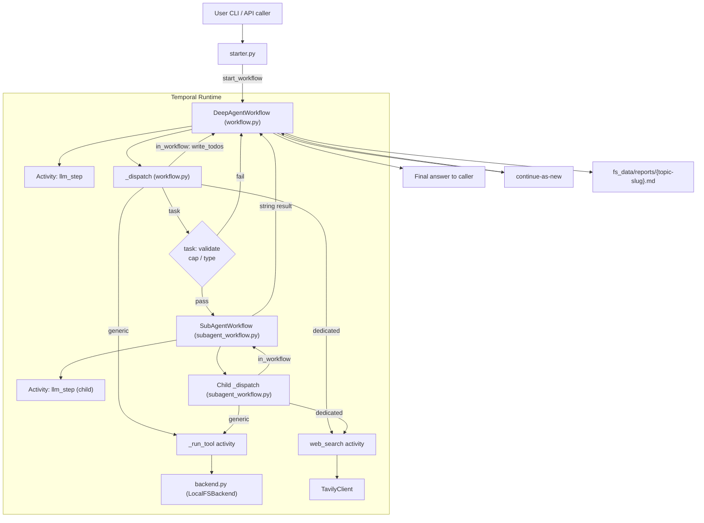
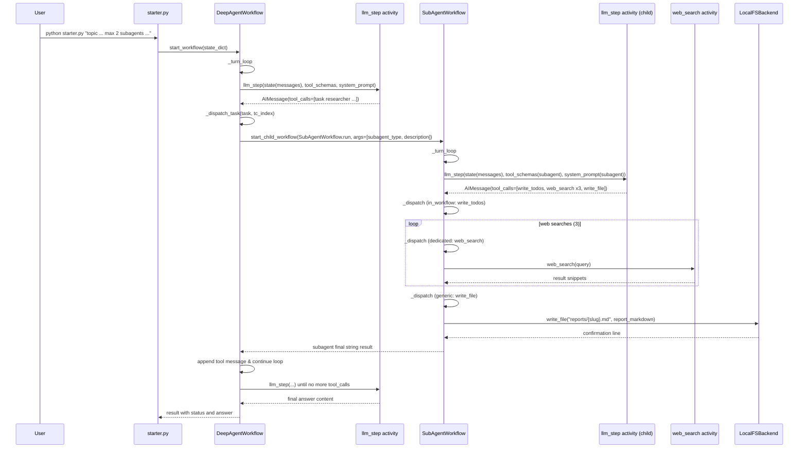
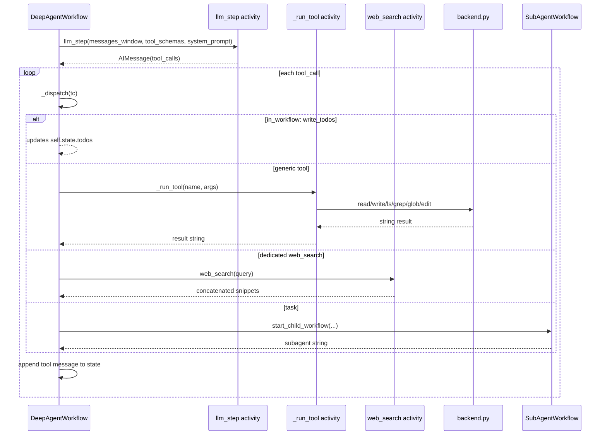

# Temporal Deep Agent

Temporal Deep Agent is a two-level hierarchical deep research system orchestrated with Temporal workflows. A parent workflow runs a loop with an LLM that can call tools. For multi-angle research tasks, the parent delegates bundled research to short-lived sub-agent child workflows.

The project also writes intermediate artifacts and final reports into a filesystem-backed reports directory.

## What this repository does

- Accepts a research topic.
- Starts a Temporal workflow on a configured task queue.
- Runs a deterministic workflow loop:
  - An activity calls the LLM to decide either:
    - to finish with an answer, or
    - to call one or more tools.
  - Tool calls are dispatched:
    - Some tools are handled directly by the workflow (in_workflow).
    - Some tools are executed by Temporal activities (generic and dedicated).
    - Some tool calls spawn child workflows (task tool).
- Uses continue-as-new to avoid unbounded workflow history.
- Supports mock LLM mode for deterministic testing via a script.

## Folder structure (temporal_deep_agent)

- `starter.py`
  - CLI entry point that parses caps in the topic text and starts the parent workflow.
- `worker.py`
  - Temporal worker entry point. Registers workflows and activities.
- `workflow.py`
  - `DeepAgentWorkflow`, the parent orchestrator.
- `subagent_workflow.py`
  - `SubAgentWorkflow`, the child workflow that runs a single sub-agent.
- `state.py`
  - `AgentState`, deterministic state carried by workflows.
- `activities/llm_step.py`
  - The non-deterministic LLM step activity. Real LLM or mock script.
- `activities/tools.py`
  - Tool schemas and dispatch activities for filesystem tools and web search.
- `backend.py`
  - Filesystem backend abstraction used by tool activities.
- `prompts.py`
  - System prompt templates for the parent, researcher sub-agent, and report writer.
- `subagents.py`
  - Sub-agent registry and configurations.
- `signal_tool.py`
  - CLI to query and signal a running workflow.
- `config.py`
  - Shared constants and environment-driven configuration.

Reports and artifacts:

- `fs_data/reports/`
  - `reports/{topic-slug}.md` are written by the report writer sub-agent.
- `fs_data/`
  - Root directory controlled by `FS_ROOT` in environment.

Mock scripts:

- `mock_llm_scripts/`
  - JSON scripts used when `LLM_BACKEND=mock`.

## Key concepts

### Temporal hierarchy

- Parent workflow: `DeepAgentWorkflow`
  - Maintains the full `AgentState`.
  - Owns the main LLM/tool loop.
  - Spawns child workflows when it decides to delegate via the `task` tool.

- Child workflow: `SubAgentWorkflow`
  - Maintains a smaller `AgentState` for a single sub-agent run.
  - Runs the same LLM/tool loop pattern but without recursion:
    - No sub-agents can spawn sub-agents, enforced by tool list composition and defensive handling.

### Determinism rule in Temporal

Workflows must be deterministic. This design follows that rule by:

- Keeping state deterministic in the workflow (`AgentState`).
- Moving non-deterministic operations into Temporal activities:
  - LLM calls are in `llm_step` activity.
  - Web search and filesystem access are in tool activities.

### Tool model

The LLM calls tools via tool schemas. Tools are registered in `activities/tools.py` as:

- in_workflow
  - `write_todos`
  - handled directly by `workflow.py`

- task
  - `task`
  - handled by spawning `SubAgentWorkflow` child workflows

- generic
  - `read_file`, `write_file`, `edit_file`, `ls`, `glob`, `grep`
  - dispatched to `_run_tool` activity which uses `backend.py`

- dedicated
  - `web_search`
  - executed by a dedicated activity `web_search`

## End-to-end architecture diagram



## Sequence diagrams

### 1) Parent workflow with delegation (Route A)

Route A corresponds to multi-angle research where the parent delegates to child agents.



### 2) Tool call flow inside the parent



## Data flow and state

### AgentState

`AgentState` is a deterministic dataclass that is stored in the workflow and serialized across activity boundaries via a dict.

Main fields:

- `messages`: list of message dicts used by the LLM
- `todos`: used for multi-step planning in the parent and researcher sub-agent
- `turn`: LLM loop turn count
- `depth`: set to 1 for sub-agent runs
- `subagent_type`: active sub-agent type for child runs
- `injected_messages`: queued signal content injected into conversation
- `topic`: original topic or subtopic description
- `continue_as_new_count`: used to bound history growth
- `max_subagents` and `subagent_count`
- `max_tavily_calls` and `tavily_count`

### LLM prompt strategy

- Parent builds a system prompt from:
  - `BASE_AGENT_PROMPT` plus:
  - runtime budget string (subagent usage and tavily usage)
  - sub-agent listing injected into the `task` tool description

- Child uses a narrower system prompt from `SUBAGENT_REGISTRY[subagent_type]`.

### Message windowing

To save tokens, both parent and child only send a bounded subset of messages to `llm_step`:

- Parent keeps:
  - the first user/topic message
  - plus the last 10 messages
- Sub-agent keeps:
  - the first user/description message
  - plus the last 8 messages

No summarization is performed.

## Continue-as-new

When either:

- workflow history exceeds `CONTINUE_AS_NEW_BYTES`, or
- `turn > MAX_TURNS`

the parent triggers `workflow.continue_as_new` with the same state dict, up to `MAX_CONTINUE_AS_NEW`.

This prevents Temporal event history from growing unboundedly.

## Mock LLM mode

If `LLM_BACKEND=mock`, `activities/llm_step.py` reads:

- `MOCK_LLM_SCRIPT` JSON file
- and replays scripted LLM steps per workflow id.

This allows predictable testing of the workflow loop and tool dispatch without calling a real model.

## Filesystem and reports

All filesystem tool activity methods are routed through:

- `backend.py` LocalFSBackend rooted at `FS_ROOT`
- configured via environment variable `FS_ROOT` (default `./fs_data`)

Reports are written under:

- `fs_data/reports/`

The report writer prompt specifies a required format and writes to:

- `reports/{topic-slug}.md`

## Report artifacts folder

This project also includes report markdown artifacts generated by the system. They live in:

- `research_agent/report_*.md`

Examples present in this repository:

- `research_agent/report_9984d4ac.md`
- `research_agent/report_AI_in_Health_Industry.md`
- `research_agent/report_AI_in_Music_industry..md`
- `research_agent/report_AI_in_Software_industry..md`

These are plain markdown documents that reflect the kind of output the report writer sub-agent is designed to produce.

## How to run

### Prerequisites

- Temporal server running and reachable at `TEMPORAL_ADDRESS`
- Environment variables:
  - `TEMPORAL_ADDRESS`
  - `TASK_QUEUE`
  - `OPENAI_API_KEY` and related model variables if using real LLM
  - `TAVILY_API_KEY` for web search

### 1) Start the worker

```bash
python temporal_deep_agent/worker.py
```

### 2) Start a deep research run

```bash
python temporal_deep_agent/starter.py "US stock market crashes and updates for today"
```

You can embed caps in the topic text, for example:

```bash
python temporal_deep_agent/starter.py "AI in healthcare, max 2 subagents, limit 5 web searches"
```

### 3) Signal a running workflow

```bash
python temporal_deep_agent/signal_tool.py status <workflow-id>
python temporal_deep_agent/signal_tool.py todos <workflow-id>
python temporal_deep_agent/signal_tool.py inject-message <workflow-id> "follow up question"
python temporal_deep_agent/signal_tool.py interrupt <workflow-id>
python temporal_deep_agent/signal_tool.py cancel <workflow-id>
```

## Failure modes and debugging

### Common issues

- Workflow history grows without continue-as-new
  - ensure `MAX_TURNS` and `CONTINUE_AS_NEW_BYTES` are configured reasonably

- LLM tool schema mismatch
  - tool names and schemas must match between:
    - system prompt tool descriptions
    - `TOOL_REGISTRY` in activities/tools.py

- Sandbox and imports
  - `worker.py` uses `UnsandboxedWorkflowRunner` because of the lazy import pattern required for `subagent_workflow.py`.

### Observability

- Query workflow state with `signal_tool.py`
- Use Temporal Web UI for:
  - activity failures
  - workflow retries
  - child workflow traces

## Configuration reference

Key environment variables from `temporal_deep_agent/config.py`:

- `TEMPORAL_ADDRESS` default `localhost:7233`
- `TASK_QUEUE` default `deep-research-queue`
- `FS_ROOT` default `./fs_data`
- `BACKEND` default `local`
- `LLM_BACKEND` default `real`
- `MOCK_LLM_SCRIPT` default `./mock_llm_scripts/example.json`
- `MAX_SUBAGENTS_DEFAULT` default `3`
- `MAX_TAVILY_CALLS_DEFAULT` default `10`

Timeout and retry settings are also defined there:
- `LLM_ACTIVITY_TIMEOUT`
- `GENERIC_TOOL_TIMEOUT`
- `WEB_SEARCH_TIMEOUT`
- `SUBAGENT_TIMEOUT`
- `STANDARD_RETRY`, `WEB_SEARCH_RETRY`, `SUBAGENT_RETRY`

## Architecture summary

- Parent workflow owns conversation and routing.
- Tools are defined via a tool registry and dispatched through a deterministic dispatcher.
- Child workflow executes bundled multi-angle research and writes reports.
- Non-determinism is isolated into activities, keeping Temporal replay safe.
